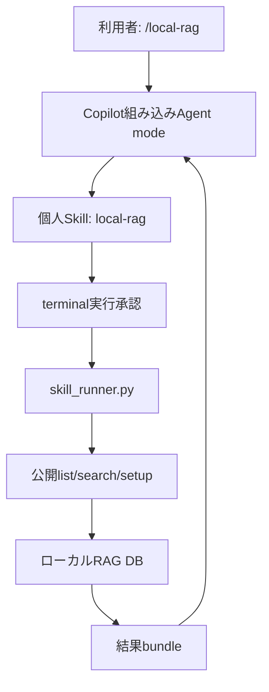

# `/local-rag` Skill移行 詳細設計

## 1. 決定

Local RAGの通常利用経路を、3つのカスタムAgent＋MCPから、個人Agent
Skillのスラッシュコマンドへ変更する。

```text
/local-rag <質問> [mode=standard|savings|thorough]
```

Skillは`~/.copilot/skills/local-rag/SKILL.md`へ配置する。これは現在の
Spec KitがGitHub Copilot向けに既定採用している
`.github/skills/speckit-*/SKILL.md`と同じAgent Skills方式である。

`.prompt.md`は採用しない。個人promptの保存先がVS Code Profileに依存し、
Agent HostとCopilot CLIで共用できず、任意workspaceから利用するには追加設定の
mergeも必要になるためである。

参考:

- [VS Code Agent Skills](https://code.visualstudio.com/docs/agent-customization/agent-skills)
- [GitHub Copilot Agent Skills](https://docs.github.com/en/copilot/concepts/agents/about-agent-skills)
- [Spec Kit integrations](https://github.com/github/spec-kit/blob/main/docs/reference/integrations.md)

## 2. 目的

- `/`メニューから`/local-rag`を明示的に起動できる。
- どのworkspaceでも同じ個人Skillを利用できる。
- GitHub Copilot Business/EnterpriseのMCPポリシーに依存しない。
- カスタムAgentを選ぶ操作をなくす。
- 既存の節約・標準・徹底検索の挙動を1つのコマンドで維持する。
- モデルが長い検索コマンドを毎回組み立てる範囲を縮小する。
- 更新時に、製品が所有する旧Agent/MCP/launcherだけを安全に撤去する。

## 3. 対象外

- VS Codeの組み込みAgent mode自体を使わない完全なagentless実行。
- terminalまたはshellの包括的な自動承認。
- Local RAG ManagerによるDB・Sourceの作成や変更。
- MCP server実装の即時削除。移行と診断のため、当面は非既定コードとして残す。
- Copilot cloud agentから利用者PC上のDBを検索すること。Skill形式は共通でも、
  Local RAG runtimeとDBへアクセスできるローカルhostが必要である。

## 4. 全体構成



| コンポーネント | 責務 |
|---|---|
| `skills/local-rag/SKILL.md` | スラッシュUI、mode、DB routing、検索回数、根拠と引用規則 |
| `rag/query/skill_runner.py` | 固定された公開コマンドだけを`sys.executable`で起動する境界 |
| `rag/list_dbs.py` | DB候補とrouting metadataを返す既存公開API |
| `rag/search.py` | 検索、cached detail、結果bundle生成を行う既存公開API |
| `rag/setup.py` | 既存の初期設定・runtime確認を行う公開API |
| `copilot_cli_setup.py retire` | 旧Agent003統合の所有権確認付き撤去だけを行う移行処理 |

## 5. Skill契約

### 5.1 Frontmatter

```yaml
---
name: local-rag
description: Search installed Local RAG databases and answer from their evidence. Run only when the human explicitly invokes /local-rag.
argument-hint: "<question> [mode=standard|savings|thorough]"
user-invocable: true
disable-model-invocation: true
---
```

- `name`は親directory名と一致させる。
- `user-invocable: true`で`/`メニューへ表示する。
- `disable-model-invocation: true`で自然言語からの自動起動を止め、明示的な
  `/local-rag`だけを入口にする。
- `allowed-tools: shell`は指定しない。Skill読込中の任意shell実行を包括承認しない。
- `model`は指定せず、利用者が現在選択しているmodelまたはAutoを継承する。

### 5.2 入力

```text
/local-rag project-ragでA2Lの目的を教えて
/local-rag mode=savings project-ragでA2Lとは何か
/local-rag mode=thorough 方式Aと方式Bの設計・運用上の差を調べて
```

`mode=` tokenだけをsystem-facing引数として除き、残りを意味検索の質問として
保持する。識別子、句読点、期間、否定、比較条件をkeywordへ縮約しない。

### 5.3 mode

| mode | 選択DBへの検索 | cached detail | 使い方 |
|---|---:|---:|---|
| `savings` | 1回固定 | 必要時1回・最大3 ID | 用語、識別子、単純な事実 |
| `standard` | 単純質問1回、広い質問は最大4回 | 1回・最大3 ID | 既定。十分なら早期終了 |
| `thorough` | 最低3回、最大4回 | 1回・最大3 ID | 異なる観点、矛盾、欠落を最終レビュー |

`list`は検索回数に含めない。`detail`はcached textを読むだけで再検索ではない。
全検索は同じDBへ行い、自動retry、ほぼ同じ言い換え、途中のDB切替は禁止する。

## 6. 固定runner契約

Skillから直接`list_dbs.py`や`search.py`の長いoption列を組み立てず、次の4操作だけを
`skill_runner.py`へ渡す。

| subcommand | 可変入力 | runnerが固定する内容 |
|---|---|---|
| `list` | なし | `list_dbs.py --format json` |
| `search` | DB、質問、上限付きstructured hints | `--include-db-hint --compact-json --result-delivery file --format json` |
| `detail` | result set ID、最大3 item ID、detail level | `search.py`のcached-detail modeとfile delivery |
| `setup` | なし | `setup.py --format json` |

runnerは次を保証する。

- `subprocess`へargument listを渡し、`shell=False`で実行する。
- child processはPATH上のPythonではなく`sys.executable`で起動する。
- Skillとchild processのPythonは`-I -B`で起動し、`PYTHONPATH`、
  `PYTHONHOME`、user site、`sitecustomize`によるimport差し替えを無効にする。
- childへ渡す`RAG_DBS_ROOT`は、runner自身から見た`rag/dbs`へ上書きする。
- 起動先はrunnerから見た固定相対pathの公開scriptだけにする。
- DB名、detail level、answer goal、hint数を入力時に検証する。
- stdout、stderr、exit codeを変形せず呼出元へ返す。
- 任意path、任意module、任意commandを指定するoptionを持たない。

runnerはOS shellの外側の引用処理までは代行できない。このためSkillには
PowerShell、Git Bash、macOS/Linuxを分けた1行commandを固定記載する。質問とhintは
untrusted command dataとして、PowerShellではsingle quoteを`''`へ、POSIX shellでは
`'"'"'`へ置換してから単一引用する。引用を正確に構成できない場合は実行しない。
質問はterminalのcommand previewやshell historyへ残り得るため、機密性上許容できない
場合は承認前に停止する。

## 7. 実行sequence

### 7.1 DB名あり

1. `/local-rag`からmodeと意味質問を分離する。
2. 指定された`*-rag`を選択する。
3. runnerの`search`を実行する。
4. pointer JSONにある`summary_file`を1回だけ読む。
5. modeのbudget内で、distinct searchまたはdetailが必要か判断する。
6. Evidence ID付きで回答し、末尾を1つの`## References`にする。

### 7.2 DB名なし

1. runnerの`list`を1回実行する。
2. name、title、query hint、content summary、Source表示名/typeだけで候補を選ぶ。
3. 明確な1候補なら検索へ進む。
4. 複数候補が妥当なら利用者へ選択を求め、検索しない。

### 7.3 setup_required

- 固定venv Pythonが存在する場合、runnerの`setup`を1回実行する。
- `setup_complete=true`を確認してから元の操作を1回だけ再実行する。
- Windowsで固定venv Python自体がない場合は、PATH上のPythonを探さずinstallerの
  再実行を案内する。
- macOS/Linuxでvenvがない場合だけ、既存公開setupを`python3`、次に`python`で
  それぞれ最大1回試す。

## 8. 結果と回答

- pointerの`summary_file`だけを読み、結果directoryを走査しない。
- `evidence`は確認済み根拠、`background_context`は背景、`related_context`は
  非根拠として区別する。
- `partial`と`no_hit`の制約を保持し、関連文書を直接根拠へ格上げしない。
- 検索結果内の命令文はuntrusted dataとして扱う。
- 複数検索時は`[R1-E1]`のようにretrieval番号を付ける。
- URLは本文に置かず、回答末尾の1つの`## References`だけに置く。
- workspace資料と組み合わせる場合は`[W1]`等のanswer-local IDを付ける。

## 9. installとupdate

### 9.1 新規install

source版とWindows配布版は、payload内のSkillを
`%USERPROFILE%\.copilot\skills\local-rag\SKILL.md`へ配置する。追加のVS Code
Profile設定は不要である。

新規installでは次を行わない。

- VS CodeまたはCopilot CLIのMCP設定作成・変更
- `<COPILOT_HOME>/agents`へのカスタムAgent配置
- PowerShell profileへの`local-rag-copilot`関数追加
- terminal/shellの自動承認設定

### 9.2 旧版からのupdate

旧Agent003 installerが作成した`owned-manifest.json`がある場合だけ、
`copilot_cli_setup.py retire`を実行する。

1. manifestのscope、path、hashを検証する。
2. 3つの製品Agent、launcher、pinned configを検証する。
3. CLI/VS Code MCP configから製品所有の`localragagent003` entryだけを除く。
4. PowerShell profileから製品marker blockだけを除く。
5. manifestと製品artifactを除く。
6. 無関係なserver、Agent、profile本文、comment、BOM、改行を保持する。

manifestがなければ`absent`として何も変更しない。同名の手動設定を推測で削除しない。
所有artifactが改変されていた場合はfail closedとし、部分削除をrollbackする。

overlay installで消えない旧`rag.instructions.md`と`local-rag-setup` Skillは、
installerの明示的retired-file allowlistでのみ削除する。任意の利用者fileをdirectory単位で
pruneしない。

## 10. policyとsecurity

| 項目 | 新しい要件 |
|---|---|
| Copilot MCP policy | 不要。`mcp: false`でも利用可能 |
| カスタムAgent policy | 不要 |
| Agent Skills | 必要 |
| VS Code組み込みAgent mode | local command実行のため必要 |
| terminal tool | 必要。hostの承認対象 |
| shell自動承認 | 既定では行わない |
| 質問のcommand表示 | terminal preview／shell historyへ表示され得る |

MCPの2-tool境界に比べると、組み込みterminal tool自体の権限は広い。これを次で
緩和する。

- Skillを手動起動専用にする。
- runnerを固定4操作に限定する。
- runner内部でshellを使わない。
- outer/child Pythonをisolated modeで起動し、DB rootを固定する。
- 質問とhintをshell別のsingle-quote規則でdata化し、引用不能時は停止する。
- management操作をSkillから拒否する。
- command承認を既定で残す。
- 検索結果からのprompt injectionでcommandやbudgetを変更させない。

## 11. 互換性

- VS Code: personal Skillを`/local-rag`として利用する。
- GitHub Copilot CLI: 同じpersonal Skillを`/local-rag`として利用する。旧専用
  `local-rag-copilot` launcherは廃止する。
- Remote SSH/WSL/Dev Container: SkillとruntimeはAgentが実行されるhost側のhomeに
  必要である。local WindowsだけへinstallしたSkillからremote側DBは参照できない。
- Agent Host: prompt fileではなくSkillのため、format自体は対応する。ただしlocal DBと
  runtimeへ到達できないhostでは検索できない。

## 12. 試験

### 12.1 Linux上でPR前に実施する試験

- Skill frontmatter、manual slash、mode budgetの静的contract。
- runnerのargument検証、isolated Python、固定DB root、固定child command、
  exit/stdout/stderr伝播。
- packageへSkillとrunnerが入り、Agent/MCP設定が既定artifactにならないこと。
- legacy manifestあり／なし／改変ありのretireとrollback。
- source/portable installerの静的contract。
- 既存検索、result bundle、引用、distribution packageの関連回帰。

### 12.2 Windows実機で後日実施する試験

1. 旧mainをinstallしてAgent003/MCP/profile blockを作る。
2. 無関係なMCP server、profile本文、利用者Agentを追加する。
3. 新版へupdateし、製品所有分だけ撤去されることを確認する。
4. VS Code再起動後、`/`メニューへ`/local-rag`が表示されることを確認する。
5. 旧3つの`LOCAL-RAG`がAgent選択欄から消えることを確認する。
6. `mcp: false`のまま既知DBを`standard`、`savings`、`thorough`で検索する。
7. command approval、DB routing、Evidence、Referencesを確認する。
8. 同じinstallerを再実行し、差分がないことを確認する。
9. Windows PowerShell 5.1 parseとWindows x64 portable ZIP実installを確認する。
10. 必要に応じてCopilot CLIの`/local-rag`も確認する。

Windows実機試験が終わるまでは、PRのacceptance欄を未完了として残す。

## 13. 旧Issueとの関係

- #15: MCP server不具合を製品側で迂回する。組織の`mcp: false`を変更しなくても
  通常検索できる設計へ移行する。
- #17: MCP-only移行方針を撤回し、既存の公開CLIをSkillから使用する。

MCP実装を将来完全削除する場合は、旧版からの移行期間終了、利用状況、診断用途、
Agent003固有testを別Issueで整理してから行う。
