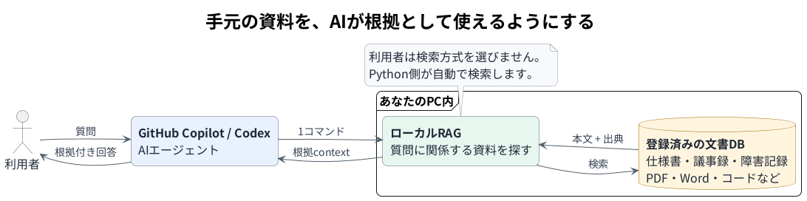
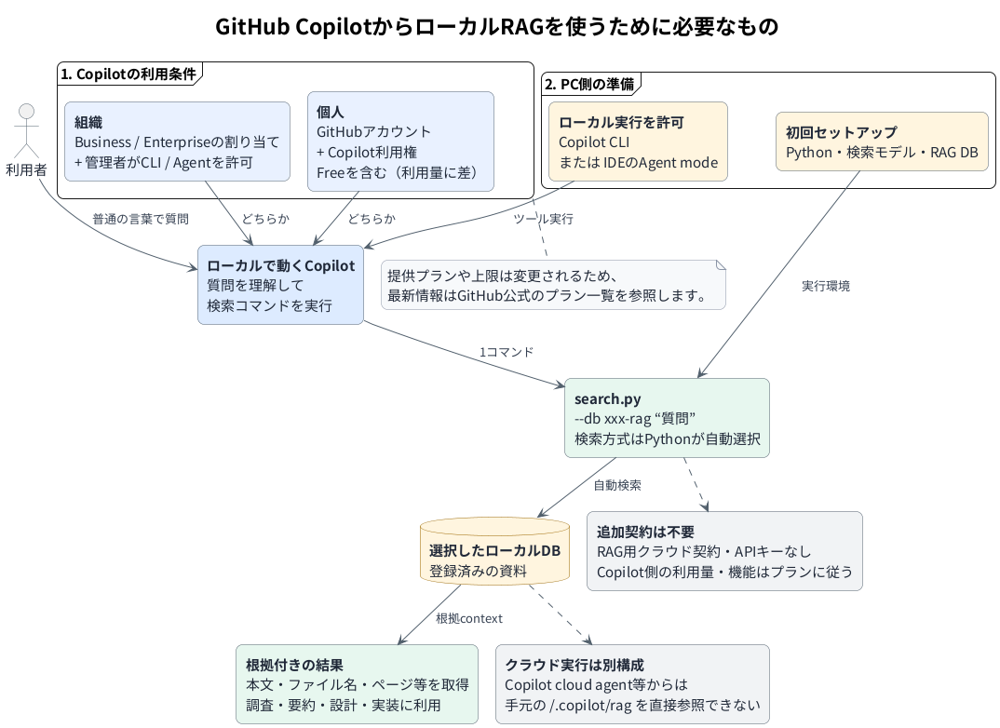
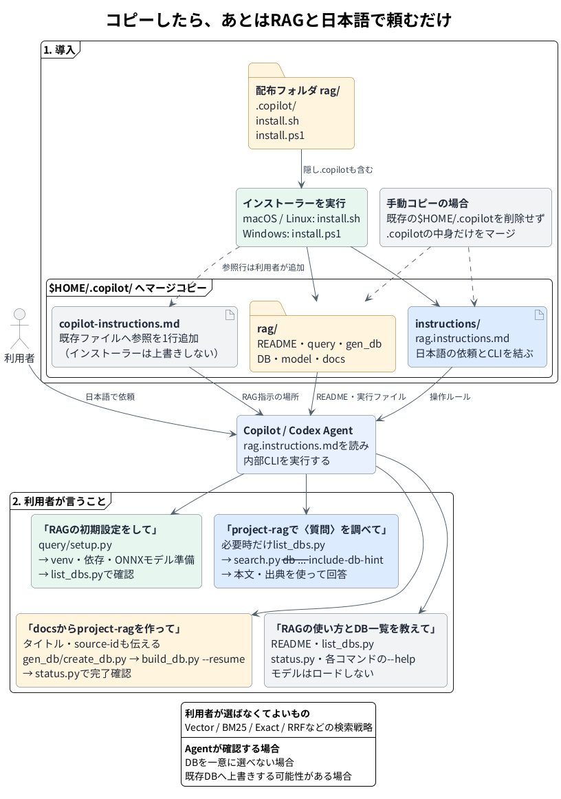
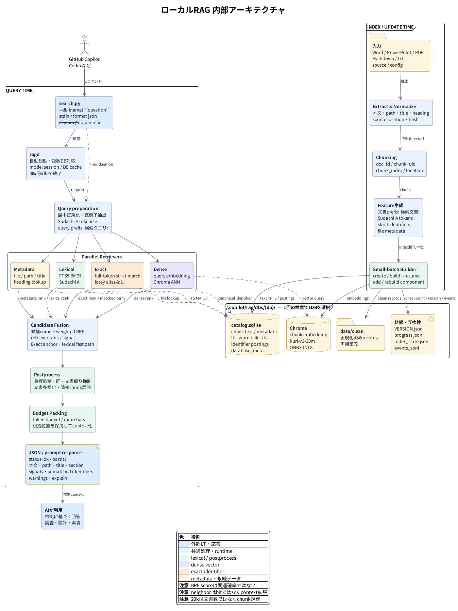
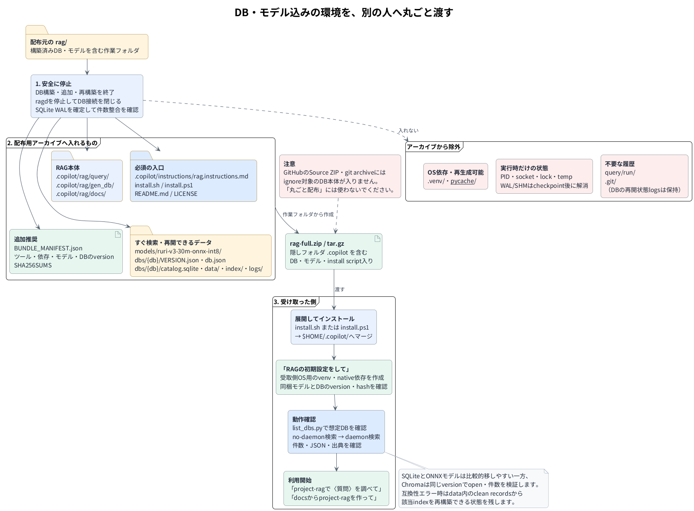

# GitHub Copilot Local RAG

**Current development version: 1.0.1**

**Release status: Unreleased release candidate**

GitHub Copilotから、ローカル文書や社内資料を自然な日本語で検索するためのRAGパックです。

Copilotへ「RAGの初期設定をして」「RAGを使ってローカル資料から検索して」「このフォルダからRAG DBを作って」のように依頼すると、Copilotが内部のPythonツールを実行します。

利用者が質問をキーワードに分解したり、ベクトル検索・全文検索・完全一致検索を選んだりする必要はありません。質問全文を一度渡すだけで、Python側が検索方式を内部で組み合わせ、回答に使いやすい根拠コンテキストを返します。

[](docs/diagrams/generated/rag-overview-beginner.png)

> [!NOTE]
> 文書の抽出・索引作成・検索はローカルで実行されます。検索で取得した本文の抜粋は、回答の根拠としてGitHub Copilotへ渡されます。

## できること

- GitHub Copilotへ日本語で初期設定・検索・DB構築を依頼
- 設計書、議事録、runbook、障害資料、ソースコードなどを横断検索
- 日本語を中心に、英語、略語、コード、識別子が混在する資料を検索
- チケットID、障害ID、エラーコード、API名、関数名、ファイル名など、抽出された識別子の完全一致検索チャネル
- ベクトル検索、BM25、完全一致、ファイル・メタデータ検索を自動統合
- 複数のRAGデータベースを用途別に管理し、名前と短いヒントからDBを選択
- 検索結果の重複や特定ファイルへの偏りを抑制
- 長時間のDB構築を中断地点から再開
- 新規・変更されたファイルだけを既存DBへ追加
- 大きな入力ツリーの一部だけを選択して構築・追加
- 一致箇所を優先しつつ、見出しや表ヘッダーなどの周辺文脈を返却
- ベクトルを再計算せず、SQLite検索インデックスだけを再構築
- 人間向け管理画面からDB・Source一覧・索引修復・安全なDB削除を操作
- 既存Sourceへ任意のWebリンクを設定し、検索結果の参照先として表示

通常利用では、検索モードや内部オプションを指定する必要はありません。

## 必要なもの

- Python 3.10以上（`pyproject.toml`の下限。上限は未固定）
- macOS、Linux、またはWindows
- GitHub Copilotを利用できるアカウントまたは組織ライセンス
- ローカルのターミナルを操作できるGitHub Copilot CLI
- 初回セットアップ時のインターネット接続
- モデル、Python依存パッケージ、RAG DBを保存できるディスク容量
- 旧形式の`.doc`または`.ppt`を扱う場合のみLibreOffice

> [!IMPORTANT]
> 組織からGitHub Copilotを割り当てられている場合は、管理者によるCLI・ローカルツール実行の許可が必要なことがあります。実行時にCopilotからシェルコマンドの承認を求められる場合もあります。IDEのエージェントモードで使う場合は、そのIDEからローカルシェルを実行でき、後述のRAG指示を参照できるよう設定してください。Copilot cloud agentなどのクラウド実行環境は、手元の`~/.copilot/rag`をそのまま参照できません。

インストーラーはmacOS・Linux・Windows向けに用意しています。現在の詳細性能試験はmacOS 26.4.1・Python 3.13.14で実施しています。Windows・Linuxへ組織配布する前には各環境でスモークテストを行ってください。Pythonの上限バージョンはCIで固定していないため、未試験の組み合わせを「試験済み」とは扱いません。

<details>
<summary>Copilotの利用条件と実行場所を図で見る</summary>

<a href="docs/diagrams/generated/rag-copilot-contract-and-usage.png">
  
</a>

</details>

## クイックスタート

### 0. リポジトリを取得する

リポジトリをcloneするか、GitHubのSource ZIPをダウンロードして展開し、そのフォルダを開きます。

> [!NOTE]
> Source ZIPにはGit管理対象のコードと指示ファイルが入ります。ignore対象の構築済みDB、モデル、インデックス、ログは含まれません。

### 1. インストール

リポジトリのルートで、使用OSに対応するインストーラーを実行します。

macOS / Linux:

```bash
bash ./install.sh
```

Windows PowerShell:

```powershell
.\install.ps1
```

インストーラーは、リポジトリ内の`.copilot/`をユーザーの`$HOME/.copilot/`へマージします。

主に次のファイルがインストールされます。

```text
$HOME/.copilot/
├── instructions/
│   └── rag.instructions.md
└── rag/
    ├── README.md
    ├── query/
    ├── gen_db/
    ├── dbs/
    ├── models/
    └── docs/
```

既存の`~/.copilot/copilot-instructions.md`は上書きしません。ただし、既存の`rag/`や`instructions/rag.instructions.md`と同名のファイルは更新される場合があります。

Copilot向けSkillとコマンドは`$HOME/.copilot`を参照するため、通常利用で
サポートするインストール先はこの既定位置です。実`network.json`を誤って配布・
上書きしないよう、`.copilot`の手動コピーではなく上記installerを使用してください。

### 2. CopilotからRAG指示を参照できるようにする

自然言語による間接操作を確実に使うため、既存の`~/.copilot/copilot-instructions.md`へ次の1行を追加します。

```text
For requests to use RAG, local documents, internal or company information, or information installed in or provided to Copilot, read ~/.copilot/instructions/rag.instructions.md.
```

このファイルが存在しない場合は新しく作成できます。インストーラーは既存の内容を上書きしません。

この追記もCopilotへ依頼できます。

```text
~/.copilot/copilot-instructions.mdへ、
“For requests to use RAG, local documents, internal or company information, or information installed in or provided to Copilot, read ~/.copilot/instructions/rag.instructions.md.”
という1行を、既存内容を残したまま追加して。
```

### 3. Copilotへ初期設定を依頼する

GitHub Copilot CLIまたはIDEのAgentへ、次のように依頼します。

```text
RAGの初期設定をして。
```

Copilotは内部で`~/.copilot/rag/query/setup.py`を実行し、次を準備します。

- 専用Python仮想環境
- 必要なPython依存パッケージ
- Ruri-v3-30m ONNX INT8モデル

準備完了後、必要に応じてCopilotが利用できるRAG DBを確認します。

<details>
<summary>導入からCopilot操作までを図で見る</summary>

<a href="docs/diagrams/generated/rag-install-help-and-commands.png">
  
</a>

</details>

### 4. 動作を確認する

まず、Copilotへ利用可能なDBの確認を依頼します。

```text
RAGの初期設定が完了しているか確認して、利用できるDBを一覧で見せて。
```

DBが表示された場合:

```text
project-ragを使って、収録内容の概要を根拠ファイル名と該当箇所付きで教えて。
```

DBがまだない場合:

```text
/path/to/docs の文書からproject-ragを作って。
タイトルは「Project Knowledge」、source-idはprojectにして。
```

## 人間向け管理画面

Copilotを介さず、人がDBを選択して検索・構築・追加・状態確認・索引修復・
削除を行う場合は、対話型managerを起動します。

macOS/Linux:

```bash
~/.copilot/rag/query/.venv/bin/python ~/.copilot/rag/manage.py
```

Windows PowerShell:

```powershell
& "$env:USERPROFILE\.copilot\rag\query\.venv\Scripts\python.exe" `
  "$env:USERPROFILE\.copilot\rag\manage.py"
```

トップ画面は初期設定・DB一覧選択・DB作成・終了だけです。DBを選ぶと、検索、
Source一覧、構築・再開、文書追加・更新、詳細状態、検索索引修復、DB削除を
操作できます。既存のPythonコマンドへ委譲するため、manager独自の検索処理や
更新判定はありません。

Source一覧は`catalog.sqlite`の索引済み文書から読み取り専用で生成されます。
Source画面からSourceを作成・削除・改名することはできません。新しい
`source_id`は、buildまたはaddが文書を正常に索引した後にだけ表示されます。

既存Sourceには任意でSource Linkを設定できます。設定はDB直下の次のsidecarへ
保存され、DBと一緒に持ち運べます。

```text
<db-root>/source-links.json
<db-root>/source-links.json.bak
```

SharePoint、GitHub、Redmine、一般WebのHTTP(S)リンクに対応します。
GitHubのrepository/refやSharePointの文書library/folder URLは人が入力し、
`.git`の検査、Gitコマンド、Microsoft Graphによる自動検出は行いません。
sidecarがないDBは従来どおりpath-onlyで動作します。設定不備も検索失敗には
せずpath-onlyへ戻り、検索順位・根拠性・`doc_id`・`chunk_uid`は変わりません。
リンク設定だけでDBや索引を再構築する必要はありません。

完全なDBをcopy/exportするとsidecarも含まれます。
`source-links.json`には内部URLが含まれる可能性があるため、移行archiveは
機密データとして扱ってください。実sidecarは公開sourceやfixtureへ含めません。

## Copilotにこう頼みます

以下はターミナルへ入力するコマンドではなく、GitHub Copilotへの依頼例です。

| やりたいこと | Copilotへの依頼例 |
|---|---|
| 初期設定 | `RAGの初期設定をして。` |
| ヘルプ | `RAGのヘルプを表示して。` |
| DB一覧 | `利用できるRAGデータベースを一覧で見せて。` |
| 候補が明確ならDBを選択して検索 | `RAGを使って、この障害の復旧手順を調べて。` |
| DBを指定して検索 | `project-ragを使って、このAPIの設計意図を調べて。根拠になったファイル名と該当箇所も示して。` |
| ローカル資料を検索 | `ローカル資料からERR_AUTH_042に関する記述を探して。` |
| 新しいDBを構築 | `/path/to/docs の文書からproject-ragを作って。タイトルは「Project Knowledge」、source-idはprojectにして。` |
| 既存DBへ文書を追加 | `/path/to/more-docs の文書をproject-ragに追加して。source-idはproject-extraにして。` |
| 構築状態を確認 | `project-ragの構築状況と、再開できるかを教えて。` |
| 中断した構築を再開 | `project-ragの前回の構築を再開して。` |
| SQLite検索を更新 | `project-ragのSQLite検索インデックスだけ再構築して。` |

DB名は用途が分かる英数字名とし、原則として`-rag`で終わらせます。`source-id`は入力資料の出所を識別する安定した名前です。同じ資料群を更新するときは同じ値を使用します。

入力ツリーの一部だけを対象にする場合も、`--root`には安定した上位
ディレクトリを指定し、対象範囲を`--scan-subdir`で指定します。

```bash
~/.copilot/rag/query/.venv/bin/python \
  ~/.copilot/rag/gen_db/build_db.py \
  --db project-rag \
  --root "/data/Project Knowledge" \
  --source-id project \
  --scan-subdir "plans/FY26" \
  --resume
```

この例で保存されるpathは
`Project Knowledge/plans/FY26/...`です。root名は常に含まれ、
Windowsでも永続pathの区切りは`/`になります。`add_data.py`の削除照合は
指定したscan範囲内に限定されるため、別の年度や別scopeの資料は削除扱いに
なりません。

> [!IMPORTANT]
> root名を含むpathへ変わると、path由来のdocument IDも変わります。
> 旧形式で作成したDBは、この形式を採用するときに一度再構築してください。

<details>
<summary>Windowsのフォルダを指定してDBを作る例</summary>

```text
C:\path\to\source-root の文書からproject-ragを作って。
タイトルは「Project Knowledge」、source-idはprojectにして。
```

</details>

### 検索時の動作

Copilotは次の順で検索対象DBを決めます。

1. DB名が指定されていれば、そのDBを使用
2. DB名がなければ`list_dbs.py`でDB名・タイトル・短いヒントを確認
3. 明確な候補が1つならCopilotが選択
4. 複数候補が妥当なら利用者へ確認

質問全文は一度だけ`search.py`へ渡します。Copilot側でキーワード分割したり、dense・BM25・exactを個別に実行したりしません。

Copilot向けの通常検索は`--result-delivery file`を使い、OSの一時領域へ
自己完結した`summary.json`と詳細アイテムをUTF-8で原子的に保存します。
初回回答はsummaryだけを1回読み、決定論的に生成された回答ドラフト、短い根拠、
制約、関連文書カードを利用します。「詳しく」などの追質問では、
`result_detail.py`が同じresult-set UUIDのキャッシュを読み、検索やDB一覧取得を
再実行しません。既存の直接JSON出力は`--result-delivery stdout`で維持されます。
一時結果はGit、`.copilot`、DB、export、release archiveへ格納されません。

検索では複数文書のprimary一致箇所を先に確保し、残りの出力予算だけで
同じsection、表ヘッダー、前後段落、関数・設定ブロックなどの周辺文脈を
補います。周辺文脈はprimaryのExactやBM25等のsignalを継承しません。
表の列見出しを確認できない場合は`table_headers_incomplete`警告を返し、
数値列の意味を推測しません。広域検索用の短いdocument cardは、周辺文脈を
付けず従来どおり独立して返します。

### RAGを使わない場合

通常の一般質問では、RAGを自動実行しません。

次のような場合にRAGを使います。

- DB名が明示されている
- 「RAGを使って」「ローカル資料から」「設計書から」など、RAG利用が明示されている
- チケットID、障害ID、エラーコード、内部API名などがDB名・ヒントと明確に対応する

単なる「調べて」「教えて」や一般的な法律・市場・地域・技術の質問だけでは、RAG利用の根拠にしません。

## DBを構築・更新するときの安全動作

Copilotは長時間処理を開始する前に、`status.py --json`で現在の状態を確認します。

- `appears_active=true`なら、同じ処理を重複起動しない
- `can_resume=true`かつ保存済み`root` / `source-id`が一致する場合だけ再開
- 保存済み`root` / `source-id`が異なる場合は、利用者へ確認
- `--force-rebuild`は、既存状態を破棄する意思が明確な場合だけ使用
- 長時間処理中は、stdoutだけを待たず定期的に状態を確認
- 既存DBへの追加は`add_data.py`を使い、現在のDB内容を維持

> [!WARNING]
> 利用者から明示的な破棄依頼がない限り、Copilotは`--force-rebuild`を使用しません。

## 対応ファイル

主な対応形式:

| 種類 | 拡張子 |
|---|---|
| Markdown・テキスト・ログ | `.md`, `.txt`, `.log` |
| PDF・Office | `.pdf`, `.docx`, `.pptx`, `.xlsx` |
| Python・JavaScript・TypeScript | `.py`, `.js`, `.jsx`, `.ts`, `.tsx` |
| Java・Go・Rust・C# | `.java`, `.go`, `.rs`, `.cs` |
| Ruby・PHP・Shell・PowerShell | `.rb`, `.php`, `.sh`, `.ps1` |
| SQL・設定ファイル | `.sql`, `.json`, `.yaml`, `.yml`, `.toml`, `.ini` |

旧形式の`.doc`と`.ppt`にはLibreOfficeが必要です。`soffice`または`libreoffice`を`PATH`から実行可能にしてください。

Markdownと元のOffice/PDFファイルが同じ入力フォルダにある場合、明示的に除外しない限り両方を登録します。検索時には内容ハッシュを利用して、可能な範囲で重複を抑制します。

## 検索の仕組み

通常検索では、次を内部的に組み合わせます。

1. Chromaによるベクトル検索
2. SQLite FTS5とSudachi AによるBM25検索
3. 識別子の完全一致検索
4. ファイル名・パス・メタデータ検索
5. weighted Reciprocal Rank Fusion
6. 重複抑制・文書多様化・隣接チャンク展開
7. トークン予算に合わせたコンテキスト構築

通常の検索方式は`hybrid`です。`lexical`と`dense`は評価・診断用です。

| 項目 | 既定値 |
|---|---|
| 埋め込みモデル | `cl-nagoya/ruri-v3-30m` |
| 実行方式 | ONNX Runtime dynamic INT8 |
| 埋め込み次元 | 256 |
| 文書prefix | `検索文書: ` |
| クエリprefix | `検索クエリ: ` |
| chunk最大文字数 | 1400 |
| chunk overlap | 160 |
| ベクトルDB | Chroma |
| lexical catalog | SQLite FTS5 |

モデルまたはprefixを変更した場合は、ベクトルインデックスの再構築が必要です。

<details>
<summary>詳細アーキテクチャ図を表示</summary>

<a href="docs/diagrams/generated/rag-internals-detailed.png">
  
</a>

</details>

## 技術リファレンス

通常利用では、ここを読む必要はありません。CLIの直接実行、社内CA、保存方式、デーモンの詳細は以下を展開してください。

<details>
<summary>手動CLI・社内CA・データ保存・検索デーモンを表示</summary>

### 手動CLI

通常はCopilotから間接的に操作します。障害調査や自動化で直接実行したい場合は、以下を使用できます。

<details>
<summary>初期設定・DB一覧・検索</summary>

初期設定:

```bash
python ~/.copilot/rag/query/setup.py
```

DB一覧:

```bash
python ~/.copilot/rag/query/list_dbs.py
```

検索:

```bash
python ~/.copilot/rag/query/search.py \
  --db project-rag \
  --include-db-hint \
  "このAPIの設計意図は？"
```

複数行、コード、引用符、シェル特殊文字を含む質問:

```bash
printf '%s\n' "質問文" |
  python ~/.copilot/rag/query/search.py \
    --db project-rag \
    --stdin
```

JSONと診断情報:

```bash
python ~/.copilot/rag/query/search.py \
  --db project-rag \
  --explain \
  --format json \
  "ERR_AUTH_042の発生条件を調べて"
```

デーモンを使用しない:

```bash
python ~/.copilot/rag/query/search.py \
  --db project-rag \
  --no-daemon \
  "質問"
```

</details>

<details>
<summary>DBの新規作成・構築・追加・状態確認</summary>

空のDB構成を作成:

```bash
python ~/.copilot/rag/gen_db/create_db.py \
  --db project-rag \
  --title "Project Knowledge" \
  --query-hint "Project API、設計書、運用手順を収録"
```

文書からDBを構築または再開:

```bash
python ~/.copilot/rag/gen_db/build_db.py \
  --db project-rag \
  --root "/path/to/docs" \
  --source-id project \
  --resume
```

既存DBへ新規・変更文書を追加:

```bash
python ~/.copilot/rag/gen_db/add_data.py \
  --db project-rag \
  --root "/path/to/more-docs" \
  --source-id project-extra
```

状態確認:

```bash
python ~/.copilot/rag/gen_db/status.py \
  --db project-rag \
  --json
```

</details>

<details>
<summary>インデックスの再構築</summary>

SQLiteのFTS・identifier・metadata検索を、埋め込み再計算なしで再構築:

```bash
python ~/.copilot/rag/gen_db/rebuild_component.py \
  --db project-rag \
  --component lexical
```

利用できるcomponent:

```text
lexical
catalog
vector
extract
all
```

古いcatalog schemaからのin-place migrationはありません。clean JSONLからcatalogを再構築するか、DB全体を再構築します。

</details>

<details>
<summary>評価・診断用の検索モード</summary>

```bash
python ~/.copilot/rag/query/search.py \
  --db project-rag \
  --retrieval-mode lexical \
  "質問"

python ~/.copilot/rag/query/search.py \
  --db project-rag \
  --retrieval-mode dense \
  "質問"

python ~/.copilot/rag/query/search.py \
  --db project-rag \
  --retrieval-mode hybrid \
  "質問"
```

通常利用では`--retrieval-mode`を指定しません。

</details>

Windowsでは、必要に応じて`python`を`py -3`へ読み替えてください。

### プロキシ・社内CA環境

プロキシを指定してセットアップ:

```bash
python ~/.copilot/rag/query/setup.py \
  --proxy http://proxy.example:8080 \
  --ca-bundle /path/to/company-ca.pem \
  --format json
```

セットアップ済み環境を変更せず検証:

```bash
~/.copilot/rag/query/.venv/bin/python \
  ~/.copilot/rag/query/setup.py \
  --verify-only \
  --format json
```

常用する設定は、配布される`network.example.json`を参考に
`~/.copilot/rag/config/network.json`へ保存できます。既定の`auto`では、実際の
download開始前にproxyへ一度だけ疎通確認し、到達不能ならsystem CAによるdirect
routeを選びます。direct accessを禁止する環境だけ`required`を使用します。実際の
`network.json`はGit・installer・release ZIPの配布対象外です。

```json
{
  "version": 1,
  "mode": "auto",
  "proxy_url": "http://proxy.example:8080",
  "ca_bundle": "/path/to/company-ca.pem",
  "no_proxy": ["localhost", "127.0.0.1", "::1"],
  "proxy_probe_timeout_seconds": 1.0
}
```

Windows PowerShell:

```powershell
py -3 "$HOME\.copilot\rag\query\setup.py" `
  --proxy http://proxy.example:8080 `
  --ca-bundle "C:\certs\company-ca.pem" `
  --format json
```

> [!CAUTION]
> 証明書検証の無効化を通常の解決策として使用しないでください。

別マシンにRAGサービスが用意されており、ローカルでは軽量Pythonクライアントだけを実行する場合は`proxy_client.py`を利用できます。

```bash
python ~/.copilot/rag/query/proxy_client.py \
  --url https://example.internal/rag \
  --db project-rag \
  --proxy http://proxy.example:8080 \
  --ca-bundle /path/to/company-ca.pem \
  "質問文"
```

### データの保存場所

```text
~/.copilot/rag/dbs/<db-name>/
├── VERSION.json
├── db.json
├── DB_PROFILE.md
├── catalog.sqlite
├── data/
│   └── clean/
├── index/
│   └── chroma/
└── logs/
```

| データ | 保存先・役割 |
|---|---|
| clean records | `data/clean/`のJSONL。インデックス再構築元 |
| vector index | `index/chroma/` |
| 本文・metadata・FTS・identifier | `catalog.sqlite` |
| DB固有の短い説明 | `DB_PROFILE.md` |
| 進捗・再開状態 | `logs/index_state.json`, `progress.json`, `events.jsonl` |

DB固有の詳細指示は毎回プロンプトへ読み込まず、必要な場合だけ参照します。

### 検索デーモン

`search.py`はdense検索が必要な場合にローカルの`ragd`を自動起動し、次をウォーム保持します。

- ONNX Runtime session
- Sudachi
- Chroma client

既定では3時間のアイドル後に終了します。問題の切り分けでは`--no-daemon`を利用できます。

</details>

## Git管理と環境の受け渡し

コードと指示ファイルはGit管理します。生成DB、モデル、インデックス、ログは通常Git管理対象外です。

そのため、GitHubのSource ZIPや`git archive`だけでは、構築済みDBを含む「すぐ使える環境」にはなりません。

DB・モデル込みで別の人へ渡す場合は、作業フォルダから隠し`.copilot`を含むアーカイブを作成します。

<details>
<summary>構築済みDB・モデルを含む環境を別の人へ渡す</summary>

<a href="docs/diagrams/generated/rag-full-environment-handoff.png">
  
</a>

配布前にDB構築処理と`ragd`を停止し、SQLiteを正常にclose・checkpointしたうえで整合性を確認します。稼働中の`catalog.sqlite`だけをコピーしたり、未反映データを含むWALを切り離したりしないでください。

進捗・再開に必要な`dbs/*/logs/index_state.json`、`progress.json`、`events.jsonl`などは保持します。主に次の再生成可能・一時ファイルを除外します。

- `.git/`
- `.venv/`
- `__pycache__/`
- `query/run/`
- PID、socket、lock、tempなどの実行時ファイル

受け取った側では`install.sh`または`install.ps1`を実行した後、Copilotへ「RAGの初期設定をして」と依頼します。その後、DBバージョン・collection件数・代表検索を確認し、既存ベクトルインデックスに互換性がなければclean JSONLから再構築します。

</details>

## 詳細ドキュメント

- [インストール後のRAG README](.copilot/rag/README.md)
- [Copilot向けRAG指示](.copilot/instructions/rag.instructions.md)
- [検索CLI](.copilot/rag/query/README.md)
- [DB構築・更新](.copilot/rag/gen_db/README.md)
- [システム設計](.copilot/rag/docs/local-rag-system-design.md)
- [最終組み合わせ試験](.copilot/rag/docs/tests/final-combination-test-design.md)
- [RAG評価計画](.copilot/rag/docs/tests/rag-evaluation-plan.md)
- [評価runbook](.copilot/rag/docs/tests/rag-evaluation-runbook.md)
- [リリース候補試験](.copilot/rag/docs/tests/release-candidate-test-plan.md)

## 注意事項

- 「ローカルRAG」は文書処理と検索がローカルであることを意味します。回答に利用する検索結果はCopilotへ渡されます。
- 一般質問ではRAGを自動実行しません。
- DB候補が曖昧な場合は利用者へ確認します。
- 通常利用では`--auto`や`--retrieval-mode`を使用しません。
- 長時間のDB処理前には`status.py --json`を確認します。
- 動作中のDB処理を重複起動しません。
- `--force-rebuild`は既存状態を破棄する明示的な依頼がある場合だけ使用します。
- 生成DB、モデル、インデックス、ログはGit管理対象外です。
- OS・Pythonごとに、対応対象と実際の試験済み範囲を区別します。

## ライセンス

本プロジェクトのソースコードは[MIT License](LICENSE)で提供されます。

埋め込みモデル、依存パッケージ、登録文書および生成DBには、それぞれのライセンス・利用条件が適用されます。
