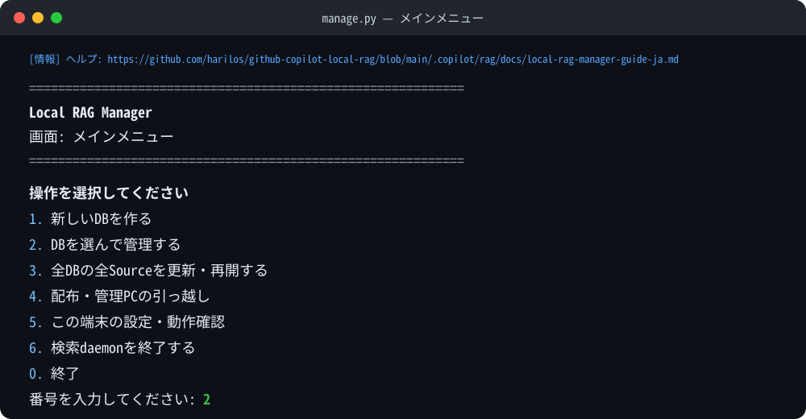
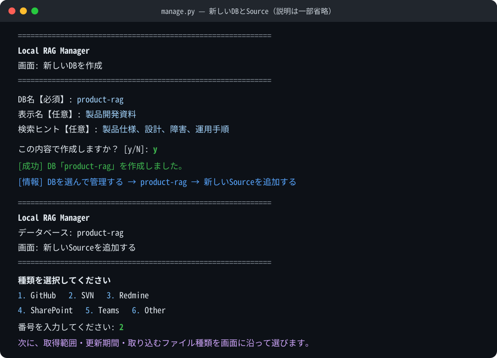
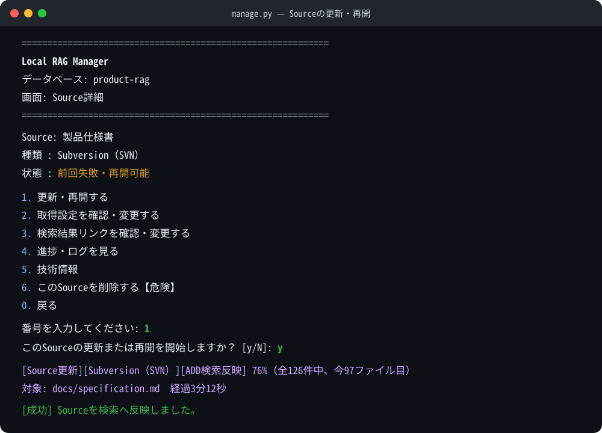

# GitHub Copilot Local RAG

> Current development version: 1.0.1
>
> Release status: Unreleased release candidate

ローカル文書や社内資料を、GitHub Copilotから自然な日本語で検索するための
RAGパックです。普段の検索ではコマンドや検索方式を覚える必要はありません。
Copilotへ「ローカルRAGを使って」と伝え、知りたいことをそのまま質問します。

文書の抽出、索引作成、検索はPC内で行われます。Copilotへ渡るのはDB全文ではなく、
選ばれた抜粋、出典、検索メタデータです。通常検索中に外部URLへアクセスする
ことはありません。

| やりたいこと | 使うもの | 操作する人 |
|---|---|---|
| 資料を検索して回答を得る | GitHub Copilotのチャット | 利用者 |
| DBや取得元を追加・更新する | Local RAG Manager | 管理者 |
| 検索用packageを配布する | Local RAG Manager | 管理者 |

## 利用者：Copilotから検索する

### 1. 初回、または初期設定が必要と表示されたとき

インストール後の最初のチャットや、検索時に初期設定が必要と表示されたときは、
Copilotへ次のように依頼します。

```text
ローカルRAGの初期設定をして
```

CopilotがPython環境、必要package、検索modelを準備します。この端末ですでに
初期設定が完了している場合だけ、この手順を飛ばせます。

### 2. 使えるDBを確認する

一覧だけ先に確認したい場合は、次のように依頼します。

```text
使えるローカルRAGのDBと、それぞれ何が入っているか教えて
```

DB名は`project-rag`のように`-rag`で終わります。以後の質問でDB名を指定すると、
一覧確認を省いてそのDBを検索できます。DB名が分からないまま質問しても、
Copilotが内部で一覧を確認するため問題ありません。

### 3. 普通の文章で質問する

「ローカルRAG」「社内資料」「インストール済みの資料」など、ローカル資料を
使うことを明示してください。単に専門用語を質問しただけでは、Copilotは勝手に
RAG検索を始めません。

| やりたいこと | Copilotへの依頼例 |
|---|---|
| 用語や識別子を調べる | `project-ragで、A2Lとは何か根拠付きで教えて` |
| 関連資料を広く探す | `project-ragで、A2Lの直接根拠と関連資料を広く探し、資料ごとの観点を整理して` |
| 複数の方式を比較する | `project-ragで、方式Aと方式Bを設計・運用・障害対応の観点で比較して` |
| DBをCopilotに選ばせる | `ローカルRAGで、A2Lの設計意図を社内資料から調べて` |
| 結果の前後を詳しく読む | `さっきの[E2]の前後をもっと詳しく見せて` |

キーワードを並べるより、知りたい目的、条件、比較軸まで含めた質問のほうが
意図に合った結果になります。検索信号はPython側で内部的に組み合わされるため、
利用者がベクトル検索、全文検索、完全一致検索などを指定する必要はありません。

DB名を省略した場合、CopilotはDB一覧を1回確認します。収録内容から1つに
絞れるときだけ検索し、候補が複数ある場合は検索前に利用者へ確認します。

### 回答と出典の見方

```text
あなた > project-ragで、A2Lの目的と採用理由を根拠付きで教えて。

Copilot > A2Lの目的は……です。[E1]
          採用理由は……と説明されています。[E2]
          次の文書は関連候補ですが、直接根拠ではありません。[D1]

          ## References

          - [E1] design.md
          - [E2] specification.pdf
          - [D1] operations-guide.md
```

- `[E…]`: 質問へ直接答える根拠
- `[B…]`: 理解を補う背景情報
- `[D…]`: 関連文書の候補。自動的に直接根拠とは扱いません

複数の検索結果を組み合わせた回答では、`[R1-E1]`、`[R2-D1]`のように、
何回目の検索結果かを示す番号が付きます。

出典は回答末尾の`## References`にまとまります。検索結果リンクが設定されて
いれば、ファイル名からGitHub、SVN、Redmine、SharePointなどの元資料を開けます。

単純な質問は1回の検索で答えます。広い調査、比較、複数論点の質問では、同じDB
の中で観点の異なる検索を必要な分だけ行います。上限は4回で、資料が十分なら
そこで止めます。`[E2]を詳しく`のような依頼は、直前の検索結果のcacheが
残っている間は、検索をやり直さず詳しい部分を読みます。

DBの内容更新から30日以上たっている場合は、同じチャットで1回だけ警告します。
古い可能性を承知で回答を読むか、管理者へDB更新を依頼してください。

## 管理者：インストールする

### 必要なもの

- macOS、Linux、またはWindows x64
- macOS/Linuxと管理用build端末ではPython 3.10以上
- Windows一般利用者向けZIPではsystem Python、`py` launcher、PATH変更は不要
- ローカルコマンドを実行できるGitHub Copilot環境
- macOS/Linuxの初期設定時に依存packageとmodelを取得できるnetwork
- Windows一般利用者向けZIPの初期設定はofflineでnetwork requestを行わない
- DB、model、索引用のdisk容量
- 旧`.doc`や`.ppt`を扱う場合のみLibreOffice

repository rootでinstallerを実行します。

macOS/Linux:

```bash
bash ./install.sh
```

Windows PowerShell:

```powershell
.\install.ps1
```

既存の`~/.copilot/copilot-instructions.md`には次の1行を追加してください。

<!-- markdownlint-disable MD013 -->

```text
For requests to use RAG, local documents, internal or company information, or information installed in or provided to Copilot, read ~/.copilot/instructions/rag.instructions.md.
```

<!-- markdownlint-enable MD013 -->

installerはLocal RAGのファイルを`~/.copilot/`へ配置しますが、完全な新規
インストールでは検索用Python環境を作りません。通常は、インストール後に
Copilotへ`ローカルRAGの初期設定をして`と依頼します。手動で行う場合は次を
実行します。

macOS/Linux:

```bash
python3 -B ~/.copilot/rag/setup.py --format human
```

Windows PowerShell:

```powershell
& "$env:USERPROFILE\.copilot\rag\query\.venv\Scripts\python.exe" `
  -B `
  "$env:USERPROFILE\.copilot\rag\setup.py" --format human
```

Windows x64の公式copy-ready ZIPには固定Python、依存package、ONNX modelが
含まれます。初期設定はvenv作成、pip、model download／変換、system Pythonへの
fallbackを行いません。VS Code Copilot ChatをAgentにし、Configure Toolsで
`runInTerminal`をONにしてください。file deliveryを使う場合は`readFile`も
ONにします。global auto-approve、Bypass Approvals、Autopilotは前提ではありません。

既存のCopilot instructions、作成済みDB、Python環境、検索daemonの状態、
端末固有のnetwork設定、Source接続設定はinstallerで不用意に上書きしません。

## 管理者：Local RAG Managerを使う

DB作成、Source追加、更新、再開、DBコピー、検索修復、配布は、人間が
対話式のManagerから行います。Copilotの通常検索はこれらを自動実行しません。

macOS/Linux:

```bash
~/.copilot/rag/query/.venv/bin/python -B ~/.copilot/rag/manage.py
```

Windows PowerShell:

```powershell
& "$env:USERPROFILE\.copilot\rag\query\.venv\Scripts\python.exe" `
  -B `
  "$env:USERPROFILE\.copilot\rag\manage.py"
```



### 初めてDBとSourceを作る

1. メインメニューで`1. 新しいDBを作る`を選びます。
2. `-rag`で終わるDB名、一覧表示名、Copilot向け検索ヒントを入力します。
3. メインメニューへ戻り、`2. DBを選んで管理する`から作ったDBを開きます。
4. `2. 新しいSourceを追加する`を選び、取得元と条件を入力します。
5. 内容を確認して`保存して取得を開始`を選びます。
6. 取得後に表示される対象件数と時間目安を確認し、検索への反映を開始します。



画面例は流れを見やすくするため、入力欄の説明と長いラベルの一部を省略しています。
検索への反映前に`1文書あたり1～5分`で計算した時間目安が表示され、もう一度
確認を求められます。ここで開始しなくてもSource設定と再開情報は残るため、
Source詳細の`更新・再開する`から続けられます。

選べる取得元は次の7種類です。

| 取得元 | 取り込み方 |
|---|---|
| GitHub | repository全体を取得し、remoteの既定branchを使う |
| SVN | 再帰／直下のみと、fileの最終更新日で検索への新規取り込み対象を絞れる |
| Redmine | projectのIssueを1件ずつ取得し、5件ごとに検索へ反映する |
| SharePoint | OneDriveで同期済みのfolderを使う。追加・更新はWindowsのみ |
| Teams | SharePoint同期root内のTeams共有folderを使う。追加・更新はWindowsのみ |
| GitLab Issue | projectのIssue本文・Discussionを取得し、5件ごとに検索へ反映する |
| Other | 手元のfileまたはfolderを一度だけ取り込む |

GitHub、SVN、SharePoint、Teams、Otherでは、`対応する全ファイル`または
`文書のみ取得`を選べます。文書のみ取得にはOffice、PDF、テキスト、
Markdown（`.md`）、Astah（`.asta`）、PlantUML（`.pu`、`.puml`）が含まれます。
`.plantuml`も文書のみ取得の対象です。

SharePointとTeamsの同期root、Redmine API key、GitLab access tokenは
`5. この端末の設定・動作確認` → `3. Source接続設定`へ登録します。秘密値や
端末固有のabsolute pathはDBへ保存しません。

GitLab Issueでは、GitLab本体のURLとprojectのトップURLを入力し、open／closed
両方のIssueとDiscussionを取得します。tokenには`read_api`権限が必要です。
GitLab上で削除された、または取得用アカウントから見えなくなったIssueは、
RAG内の既存文書を削除せず、そのまま保持します。次回以降の更新では、取得用
アカウントから見えるIssueだけを新規作成または上書きします。初回取込後は
GitLab本体URLとproject URLを変更できません。別のprojectへ切り替える場合は、
新しいSourceとして追加します。

### Sourceを更新する・中断した処理を再開する

用途に応じて次の入口を使います。

| 更新範囲 | メニューの進み方 |
|---|---|
| 1つのSource | `2. DBを選んで管理` → DB → `1. Sourceを見る・更新` → Source → `1. 更新・再開` |
| 1つのDBすべて | `2. DBを選んで管理` → DB → `3. このDBの全Sourceを更新・再開` |
| 全DBすべて | メインメニューの`3. 全DBの全Sourceを更新・再開` |



取得と検索反映は進捗、処理件数、現在のfile、経過時間を表示します。中断や失敗が
起きても、保存済みcheckpointから同じ`更新・再開する`で続けられます。

### DBをコピーする

`2. DBを選んで管理する` → DB → `5. このDBのコピーを作る`と進みます。
初期状態では全Sourceがコピー対象です。番号を入力すると、コピーしないSourceへ
切り替わり、端末上では取り消し線付きで表示されます。コピー先は元DBから独立し、
以後のSource更新や削除も別々に行えます。Sourceの取得設定も引き継ぐため、
コピー先でも元DBと同じ取得元を更新できます。

### そのほかの主な操作

| やりたいこと | 入口 |
|---|---|
| DBの表示名・検索ヒントを変える | DBメニューの`4` |
| 検索を試す・検索索引を修復する | DBメニューの`6. 問題があるとき` |
| 利用者用packageを作る | メインメニューの`4. 配布・管理PCの引っ越し` |
| 管理PCを引っ越す | メインメニューの`4. 配布・管理PCの引っ越し` |
| 端末の接続設定や動作を確認する | メインメニューの`5` |
| 検索daemonを終了する | メインメニューの`6` |

検索daemonを終了すると、次回検索時に自動起動します。待機中または実行中の検索が
失敗する可能性があるため、検索している人がいないことを確認してから使います。

Manager共通の入力方法:

- `【必須】`: 空欄では進みません
- `【任意】`: 空欄で未設定です
- `:q`: 保存せず前の画面へ戻ります
- Enter: 編集画面では現在値を維持します
- `-`: 任意項目の現在値を消します
- `Ctrl+C`: 未保存の変更を破棄します

全画面とProviderごとの詳しい入力項目は
[Local RAG Manager 日本語操作ガイド](.copilot/rag/docs/local-rag-manager-guide-ja.md)
を参照してください。

## 配布と管理PCの引っ越し

Managerは用途の異なる2種類を作成します。

| 種類 | 用途 | 形式 |
|---|---|---|
| 利用者向け検索package | 現在の全DBを別PCで検索する | ZIP |
| 管理PC引っ越しpackage | 現在の全DBとSource再開情報を含めて管理を移す | 再開可能なfolder |

利用者向けpackageの受取側はZIPを展開し、Windowsでは`.\install.ps1`、
macOS/Linuxでは`sh ./install.sh`を実行します。スクリプトは中の`.copilot`
本体を自分のhome directoryへ統合copyし、既存のPython環境や端末固有設定を
削除しません。その端末で初期設定がまだなら、Copilotへ
`ローカルRAGの初期設定をして`と依頼します。また、
`~/.copilot/copilot-instructions.md`へインストール節と同じRAG routingの1行を
追加します。管理PC引っ越しpackageは、Managerの
`パッケージを取り込む・検証する`から取り込みます。

packageには検索資料と内部URLが含まれる場合があります。機密資料として安全に
扱ってください。credential、端末固有設定、実行中の一時fileは含めません。

## 直接CLIで確認する場合

通常の利用者はこの節を使いません。Copilotを介さず、人間がDB一覧や検索結果
（直接根拠、背景、関連文書候補）を確認したい場合の入口です。手動検索は
最終回答を作文しません。

### macOS/Linux

```bash
~/.copilot/rag/query/.venv/bin/python \
  -B \
  ~/.copilot/rag/list_dbs.py --format text

~/.copilot/rag/query/.venv/bin/python \
  -B \
  ~/.copilot/rag/search.py \
  --db project-rag \
  --include-db-hint \
  --result-delivery stdout \
  --format prompt \
  "A2Lの目的と採用理由を教えて"
```

### Windows PowerShell

```powershell
& "$env:USERPROFILE\.copilot\rag\query\.venv\Scripts\python.exe" `
  -B `
  "$env:USERPROFILE\.copilot\rag\list_dbs.py" `
  --format text

& "$env:USERPROFILE\.copilot\rag\query\.venv\Scripts\python.exe" `
  -B `
  "$env:USERPROFILE\.copilot\rag\search.py" `
  --db project-rag `
  --include-db-hint `
  --result-delivery stdout `
  --format prompt `
  "A2Lの目的と採用理由を教えて"
```

Copilotが内部で利用する公開入口は`~/.copilot/rag/list_dbs.py`と
`~/.copilot/rag/search.py`の2つです。検索の内部構造、結果JSON、Source Metadata、
path規則、network/proxy、package検証については
[Local RAG system design](.copilot/rag/docs/local-rag-system-design.md)を
参照してください。

## License

repository内のlicenseと、同梱する各dependency/modelのlicenseを確認して
利用してください。


### Windows portable multi-database ZIP

The Windows portable builder selects databases from one trusted parent directory.
Use `-DatabasesRoot` with repeatable `-DatabaseNames`, or omit the names to
open the shared toggle selector. Use `-NoDatabase` only for an explicit
runtime-only package. Extract the completed ZIP and run the top-level ASCII
`install.cmd`; its implementation is manifest-covered at
`internal\install.ps1`. Existing unrelated databases are preserved, and a
differing same-name database is replaced only with
`-ReplaceExistingDatabases`.
